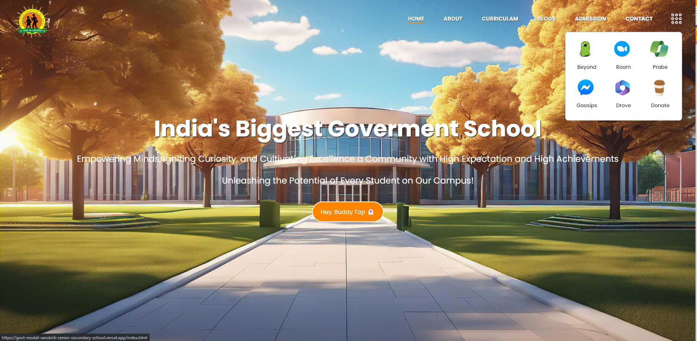

### School Webapp

Welcome to our school web application project! This dynamic web application is designed to streamline interactions between students, teachers, and administrative staff. With a responsive user interface, users can seamlessly access information, interact, and perform various tasks.

### Preview



### <a name="table">Table of Contents</a>

1. [Tech Stack](#tech-stack)
2. [Features](#features)
3. [Getting Started](#getting-started)
4. [Feedback](#feedback)
5. [Contributors](#contributors)

### <a name="tech-stack">Tech Stack</a>

- HTML5
- CSS
- JavaScript

### <a name="features">Features</a>

- **Information Showcase:** The web application provides a platform to showcase all relevant information about the school, including events, news, academic programs, and more.
  
- **Login/Signup:** Users can create accounts or log in securely to access personalized features and content.
  
- **Dashboard:** Once logged in, users are greeted with a personalized dashboard where students can view their grades, assignments, and announcements, while teachers can manage classes, grades, and assignments.
  
- **Interaction between Students and Teachers:** The platform facilitates communication and collaboration between students and teachers through messaging, assignment submissions, and feedback.
  
- **Admission Process:** Prospective students can apply for admission online, streamlining the admission process for both the school administration and applicants.
  
- **Online Gateway Application:** The web application incorporates an online payment gateway for various purposes such as fee payments, event registrations, and donations.

### <a name="getting-started">Getting Started</a>

### Prerequisites

- [Git](https://git-scm.com/)

### Cloning

1. **Clone the Repository:**

    Run the following command in your terminal or command prompt to clone the repository to your local machine:

    ```
    git clone https://github.com/theankushshah/Govt.Model-Sanskriti-Senior-Secondary-School.git
    ```

2. **Navigate to the Project Directory:**

    Once cloned, navigate into the project directory using the `cd` command:

    ```
    cd Govt.Model-Sanskriti-Senior-Secondary-School
    ```

### Download

1. **Download ZIP Code folder:** 

    Unzip the folder in your machine.

2. **Navigate to the Downloaded Directory:** 

    Open your code editor and open the unzipped folder in it then:

    ```bash
    cd /path/to/downloaded/folder
    ```

### Cloning & Download

1. **Start Coding:**

    Feel free to edit the code according to your requirements.

### Github

1. **Initialize a New Git Repository:**

    ```bash
    git init
    ```

2. **Stage and Commit the Code:**

    ```bash
    git add .
    git commit -m "Initial commit"
    ```

3. **Create a New Repository on GitHub:**

    Do not initialize the new repository with a README, .gitignore, or license.

4. **Link Local Repository to GitHub:**

    ```bash
    git remote add origin https://github.com/username/new-repo.git
    ```

    Replace https://github.com/username/new-repo.git with your actual repository URL.

5. **Push Code to GitHub:**

    ```bash
    git branch -m main
    git pull origin main
    git push -u origin main
    ```

6. **Deployment:** 
    
    Deploy the application to your preferred hosting platform to make it accessible online.

### Forking

1. **Forking:** 

    Run the following command in your terminal or command prompt to fork the repository to your local machine:

    ```bash
    git clone https://github.com/your-username/Govt.Model-Sanskriti-Senior-Secondary-School.git
    ```

2. **Navigate to the Directory:** 

    Once cloned, navigate into the project directory using the `cd` command:

    ```bash
    cd Govt.Model-Sanskriti-Senior-Secondary-School
    ```

3. **Start Coding:** 

    Make the additions & desired changes to the code.

4. **Commit & Push Your Changes to Your Fork:** 

    Once cloned, navigate into the project directory using the `cd` command:

    ```bash
    git add .
    git commit -m ""
    git pull origin main
    git push -u origin main
    ```

5. **Create a Pull Request:**

- Go to your forked repository on GitHub
- Click the "Compare & pull request" button.
- Review your changes and write a clear description of your contribution.
- Click "Create pull request"

    **I will review your pull request and decide whether to merge your changes into my repository or not**


## <a name="feedback">Feedback</a>

You might encounter some bugs while using this app. You are more than welcome to contribute. Just submit changes via pull request and I will review them before merging. Make sure you follow community guidelines.

## <a name="contributors">Contributors & Main</a>

- Ankush Shah (ankushsahvlogs@gmail.com) (Main)

Happy coding!
